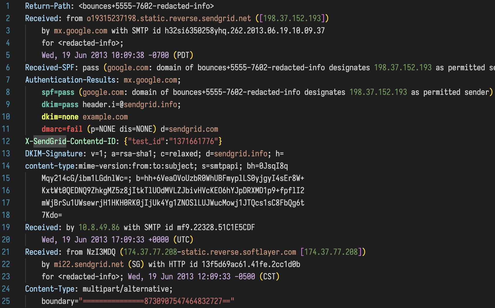

# email-headers-highlight

This extension allows for highlighting the syntax of email headers in .eml files and plaintext. It is a custom syntax highlighting extension for Visual Studio Code written with tmlanguage grammar.

## Features

The extension highlights the syntax of email headers in .eml files and plaintext. It also highlights the following for easy readability and quicker analysis:

- DMARC results
- DKIM results
- SPF results
- ip addresses
- domains
- email addresses
- timestamps
- ... and more



## Requirements

There are no external requirements or dependencies for this extension.

## Extension Settings

The extension will work with both light and dark themes.

All of the color settings can be customized in VS Code settings. The following is an example if you wish to change the default color settings:

```json
{
  "editor.tokenColorCustomizations": {
    "textMateRules": [
      {
        "scope": "entity.name.ip.address",
        "settings": {
          "foreground": "#FF0000"
        }
      },
      {
        "scope": "entity.name.email.address",
        "settings": {
          "foreground": "#00FF00",
          "fontStyle": "italic"
        }
      },
      {
        "scope": "variable.other.readwrite.variablecolon",
        "settings": {
          "foreground": "#0000FF",
          "fontStyle": "bold underline"
        }
      },
      {
        "scope": "entity.name.emailsec.pass",
        "settings": {
          "foreground": "#008B8B"
        }
      },
      {
        "scope": "entity.name.emailsec.fail",
        "settings": {
          "foreground": "#B22222"
        }
      },
      {
        "scope": "string.quoted.double.email",
        "settings": {
          "foreground": "#A31515"
        }
      },
      {
        "scope": "constant.character.escape.email",
        "settings": {
          "foreground": "#B5CEA8"
        }
      },
      {
        "scope": "entity.name.domain.address",
        "settings": {
          "foreground": "#A31515"
        }
      }
    ]
  }
}
```

## Known Issues

There are no known issues currently.

## Release Notes

See [CHANGELOG.MD](CHANGELOG.md)